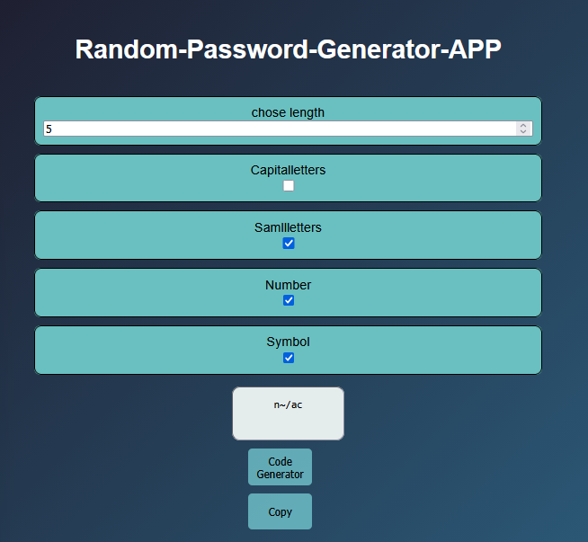

# Random-Password-Generator
Perfect for social media, banking apps, email accounts, and gaming passwords.
# 🔐 Password Generator App

A simple and secure Password Generator App built using HTML, CSS, and JavaScript.  
This app helps users generate strong random passwords with customizable options.

---

## 🚀 Features

- Generate strong random passwords
- Copy password to clipboard
- Customize password length
- Include:
  - Uppercase letters
  - Lowercase letters
  - Numbers
  - Symbols
- Responsive design
- Easy to use UI

---

## 🛠️ Technologies Used

- HTML5
- CSS3
- JavaScript (Vanilla JS)

---

## 📸 Screenshot


## 📂 Project Structure

```bash
password-generator/
│
├── index.html
├── style.css
├── script.js
└── README.md